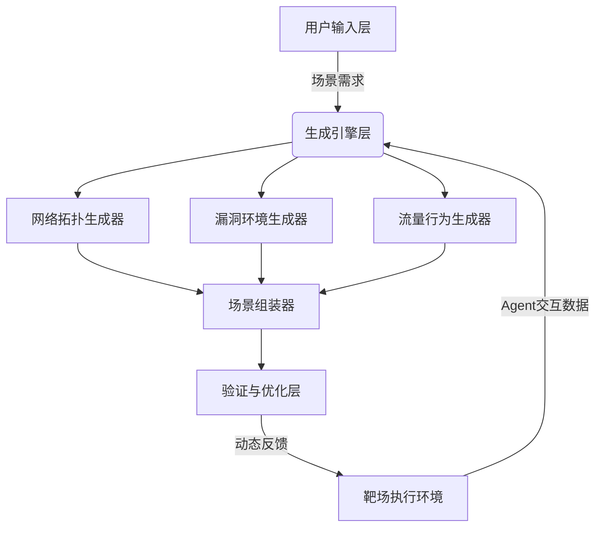

---
{"dg-publish":true,"permalink":"///"}
---

### 设计

### 具体实现
1. **场景描述解析器**
    - 输入：自然语言描述（如"模拟某医疗机构的VPN+数据库攻防"）
    - 输出：结构化场景模板（JSON/YAML）
    - 技术：LLM（GPT-4/Claude） + 规则引擎（Drools）
2. **[[揭榜挂帅/资源生成器\|资源生成器]]**
    - 网络拓扑：基于GAN生成虚拟网络设备关系图
    - 漏洞环境：通过Dockerfile模板库+LLM动态适配
    - 流量模式：时间序列生成模型（如TimeGAN）
3. **动态调整引擎**
    - 实时监听Agent行为（如攻击成功/防御动作）
    - 触发场景参数更新（如开放新端口、关闭漏洞）