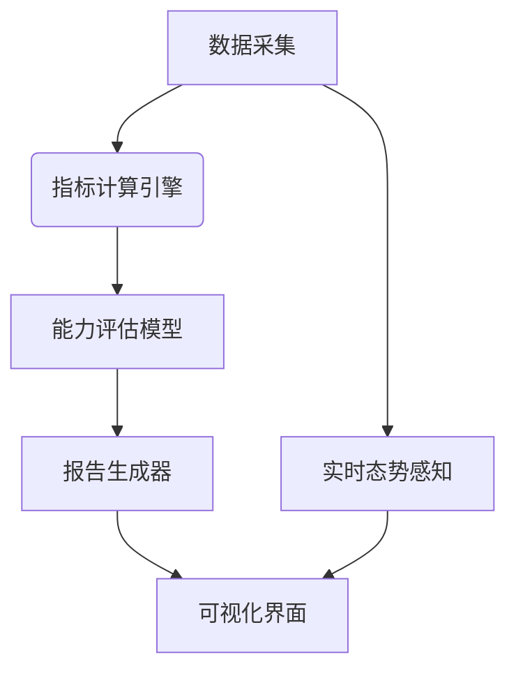

---
{"dg-publish":true,"permalink":"///"}
---



### 组件
1. 多数据
   - 攻击面数据：攻击路径、漏洞利用记录
   - 防御面数据：阻断动作、策略调整日志
   - 环境数据：CPU/内存波动、网络流量模式

2. 评估指标
```python
metrics = {
    "attack": ["突破时间", "横向移动深度", "攻击链完整性"],
    "defense": ["平均响应时间", "误报率", "策略有效性"],
    "overall": ["风险暴露面", "安全成熟度", "团队协作度"]
}
```

3. 动态权重
   $$W_i = \frac{CVSS_i \times A_i}{\sum(CVSS \times A)}$$
其中 $A_i$ 为资产价值系数
---
### 评估细节
#### 攻击方
```python
def calculate_attack_score(attack_log):
    # 基于ATT&CK框架的战术覆盖度
    coverage = len(set(log["technique_id"] for log in attack_log)) / 180  # MITRE总技术数
    # 攻击效率指数
    efficiency = 1 / (breakthrough_time + lateral_movement_steps*0.2)
    return 0.6*coverage + 0.4*efficiency
```

#### 防御方
```python
class DefenseEvaluator:
    def __init__(self):
        self.fp_penalty = -0.5  # 误报惩罚系数
        
    def evaluate(self, actions):
        score = 0
        for action in actions:
            if action["valid"]:
                score += 1 - action["delay"]/300  # 延迟惩罚
            else:
                score += self.fp_penalty
        return score
```

#### [[揭榜挂帅/人物能力\|人物能力]]
---
### 自动化报告

1. 动态模板
```jinja2
# 报告模板片段

本次演练中红队表现出色，成功覆盖{{ coverage }}%的ATT&CK技术。

需加强在{{ weak_techniques|join(', ') }}等领域的训练。

```
>[!tip]
>jinja2是基于python的动态模板

2. 多模态输出

|输出类型|技术方案|示例内容|
|---|---|---|
|PDF报告|LaTeX模板 + Pandoc转换|包含详细数据表格|
|交互看板|Elasticsearch + Kibana|实时攻防态势热力图|
|训练建议|LLM生成 + 知识库检索|"建议学习OSCP课程模块3"|