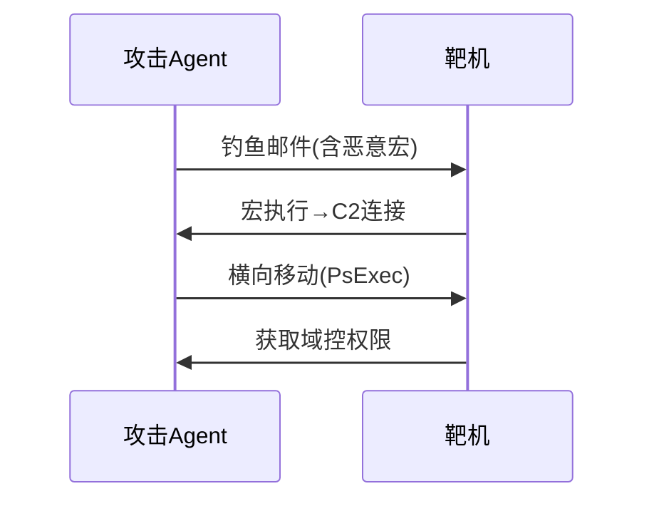

---
{"dg-publish":true,"permalink":"/揭榜挂帅/攻击/"}
---

### 原子动作
```python
class ExploitAction:
    def __init__(self, cve_id): # cve_id 漏洞序列号
        self.payload = self._generate_payload(cve_id)
        
    def execute(self, target_ip):
        return requests.post(f"http://{target_ip}/api", 
            data=self.payload, 
            headers={"User-Agent": "Mozilla/5.0"}
        )
```

### 多阶段攻击

