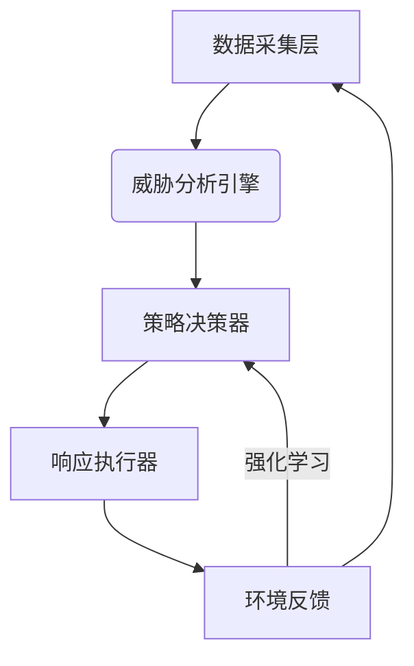

---
{"dg-publish":true,"permalink":"/揭榜挂帅/自适应防御决策/"}
---


---
### 组件
1. 多数据融合
   - 日志类型：网络流量（Zeek/Suricata）、主机审计（Osquery）、云原生（K8s事件）
   - 采样频率：关键事件实时处理（<100ms延迟），批量日志分钟级聚合

1. [威胁](威胁)矩阵
```python
threat_matrix = {
    "severity": 0-10,  # CVSS评分
    "confidence": 0-1, # 模型置信度
    "propagation_risk": 0-1,  # 横向移动概率
    "business_impact": ["DB", "Auth"]  # 受影响关键资产
}
```

3. 策略库
- 防御模式：MITRE Shield + NIST CSF框架
- 动作
```json
{
  "action_type": "network_quarantine",
  "target": "192.168.1.5",
  "parameters": {"duration": "2h"},
  "rollback_condition": "threat_score<0.2"
}
```


