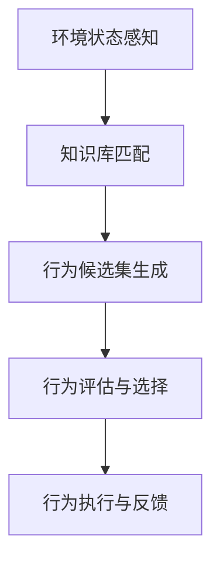

---
{"dg-publish":true,"permalink":"/揭榜挂帅/行为选取/"}
---

### 决策流程

### 实现细节
#### 环境感知
- **攻击场景**：
    - 当前攻击阶段（如初始访问、横向移动）。
    - 已发现的漏洞或脆弱点（如开放端口、未打补丁服务）。
- **防御场景**：
    - 检测到的威胁指标（如可疑进程、异常登录）。
    - 系统防护状态（如防火墙规则、EDR告警）。
- **数据来源**：
    - 日志（Sysmon、SIEM）。
    - 实时监控（网络流量、进程行为）。

####  知识库匹配
- **攻击行为库（ATT&CK）**：
    - 输入：当前攻击阶段（如`TA0002 Execution`）。
    - 输出：相关技术（如`T1059.001 PowerShell`、`T1106 Native API`）。
- **防御行为库（Shield）**：
    - 输入：检测到的攻击技术（如`T1059.001`）。
    - 输出：反制措施（如`T1497.001 进程行为混淆`）。