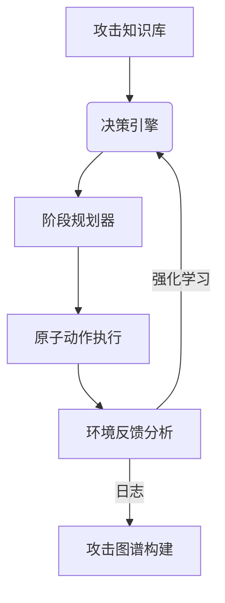

---
{"dg-publish":true,"permalink":"/智能攻击模拟/"}
---

### 设计

### 具体实现
1. **[攻击](攻击.md)知识图谱**
    - 数据源：MITRE ATT&CK框架、CAPEC攻击模式、CVE漏洞库
    - 存储：Neo4j图数据库（关联TTPs与漏洞）
2. **多Agent决策系统**
    - **规划Agent**：Hierarchical RL生成攻击路径
    - **执行Agent**：按阶段调用Metasploit/自定义工具
    - **隐蔽Agent**：生成诱饵流量（如使用GAN模拟正常用户）
3. **自适应引擎**
    - 动态调整攻击策略（如遇WAF时切换至0day漏洞）
    - 实时学习防御模式（通过深度逆强化学习）