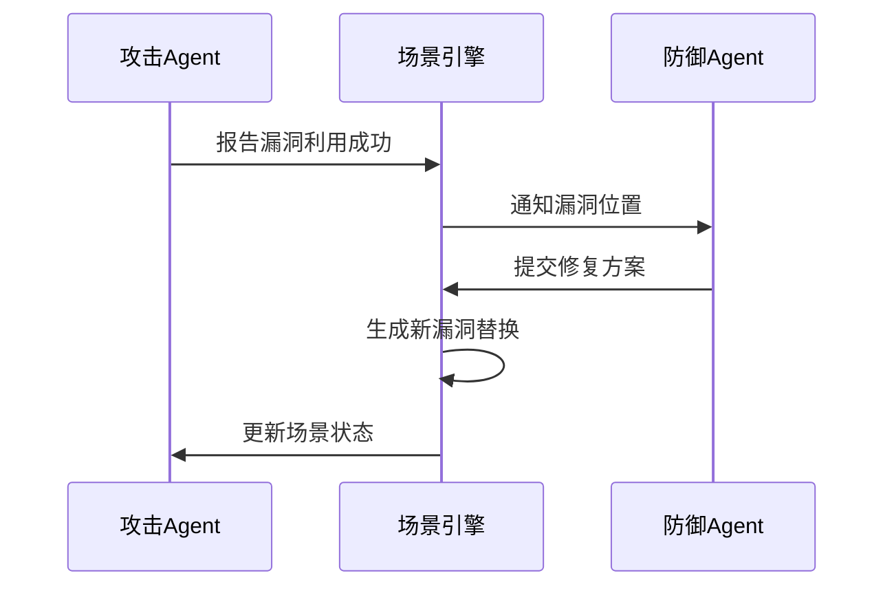

---
{"dg-publish":true,"permalink":"/资源生成器/"}
---

### 网路拓扑
1. 知识抽取
   - 从NIST/ISO27001等标准中提取网络分区规则
   - 使用信息抽取模型（如BERT-NER）识别关键实体
   ```python
# 示例：从文本中提取网络要素
text = "DMZ区应部署Web服务器，与内网数据库通过防火墙隔离"
entities = ner_model(text)  # 输出: {"DMZ": ["Web"], "Internal": ["Database"], "rules": ["Firewall"]}
```

2. 图结构
   - 使用**GraphGAN**生成符合企业架构的拓扑
   - 约束条件：最小攻击路径长度、关键节点冗余度
---
### 环境漏洞
1. 动态dockerfile
~~~python
def generate_dockerfile(cve_description):
    prompt = f"""根据CVE描述生成Dockerfile:
    {cve_description}
    要求: 1. 包含漏洞 2. 可正常服务 3. 标签为vuln_image"""
    response = llm.generate(prompt)
    return validate_dockerfile(response)  # 安全性校验
~~~

---
### 流量和行为
1. 正常流量
```python
from sdv.tabular import CTGAN
model = CTGAN.load('web_log_model.pkl')
fake_logs = model.sample(num_rows=1000)  # 包含User-Agent、URL等字段
```

2. 攻击流量
```json
{
  "tactic": "TA0001-InitialAccess",
  "techniques": [
    {"id": "T1078-ValidAccounts", "payload": "admin:password123"},
    {"id": "T1195-SupplyChain", "trigger": "npm install malicious-pkg"}
  ]
}
```

---
### 动态调整


